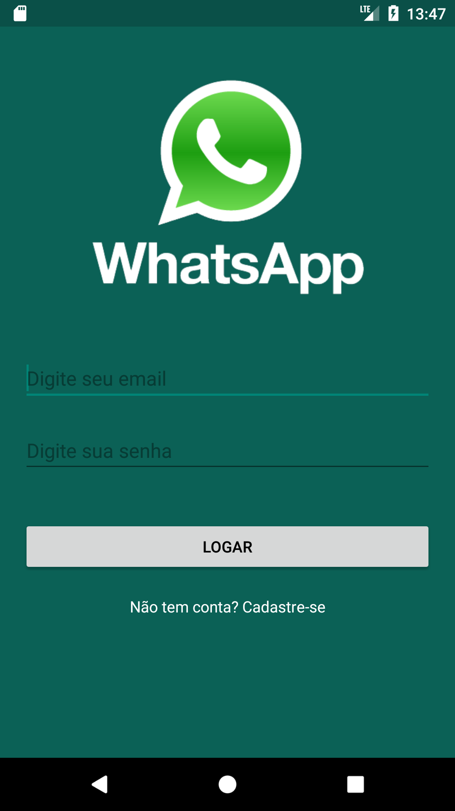
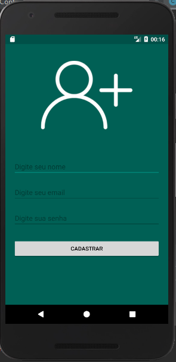
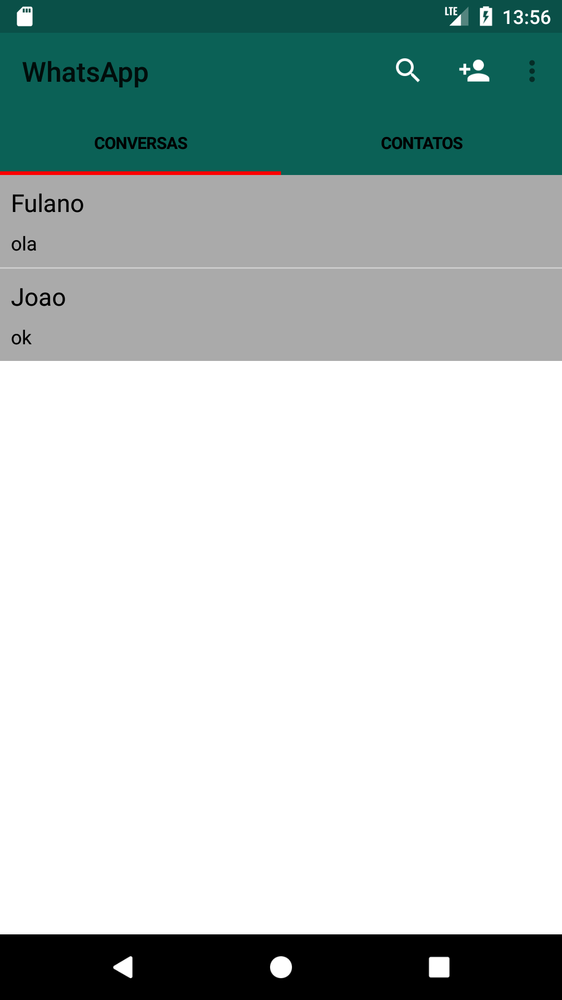
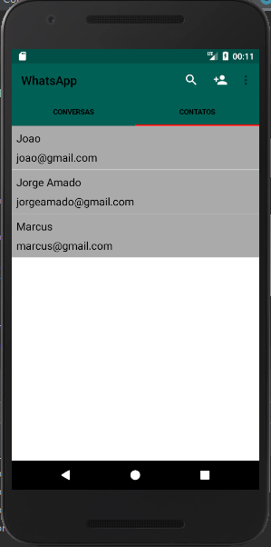
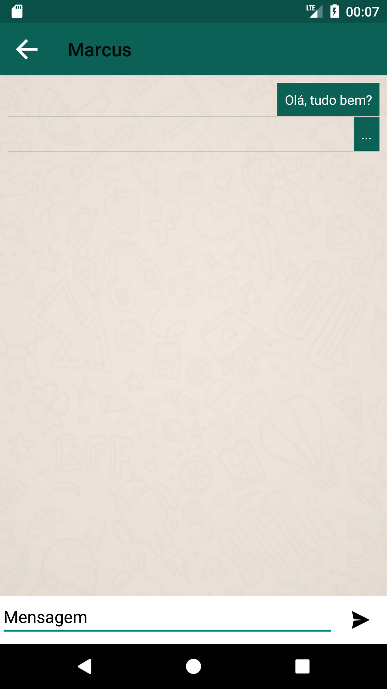

# WhatsAppClone

## Sumário
- [WhatsAppClone](#whatsappclone)
  - [Sumário](#sumário)
  - [Descrição](#descrição)
  - [Pré-requisitos](#pré-requisitos)
  - [Imagens do Aplicativo](#imagens-do-aplicativo)
  - [Tecnologias Utilizadas](#tecnologias-utilizadas)
  - [Como Contribuir](#como-contribuir)

## Descrição

Projeto criado para a plataforma [Android](https://www.android.com/intl/pt-BR_br/), sendo utilizado o [Firebase](https://firebase.google.com/) para a base de dados dessa aplicação.

O projeto é uma simples cópia do aplicativo 'WhatsApp', contendo uma lista de contatos, conversas e chats. Você pode cadastrar uma nova conta, adicionar colegas e iniciar uma nova conversa pelo chat de mensagens.

## Pré-requisitos

Para poder realizar a execução desse aplicativo é necessário que possua a IDE do [Android Studio](https://developer.android.com/studio?hl=pt-br) para executá-lo. Deve possuir também um emulador de smartphone configurado para a utilização do mesmo. 

## Imagens do Aplicativo

 

## Tecnologias Utilizadas

## Como Contribuir

Contribuições são sempre bem-vindas. Existem várias maneiras de contribuir com este projeto, como:

- 🌟 Dando uma estrela no projeto.
- 🐛 Reportando um Bug.
- 😅 Indicando um vacilo que eu possa ter cometido.
- 📄 Ajudando a melhorar a documentação.
- 🚀 Compartilhando este projeto com seus amigos.

Voltar ao [topo](#whatsappclone).
